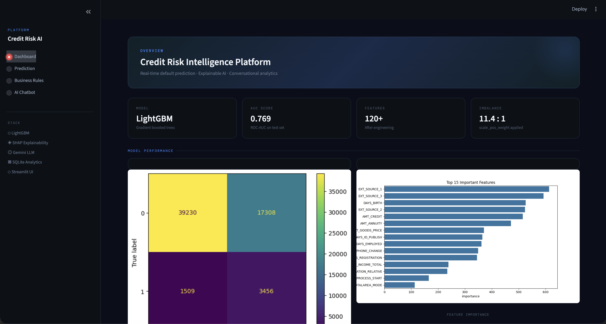
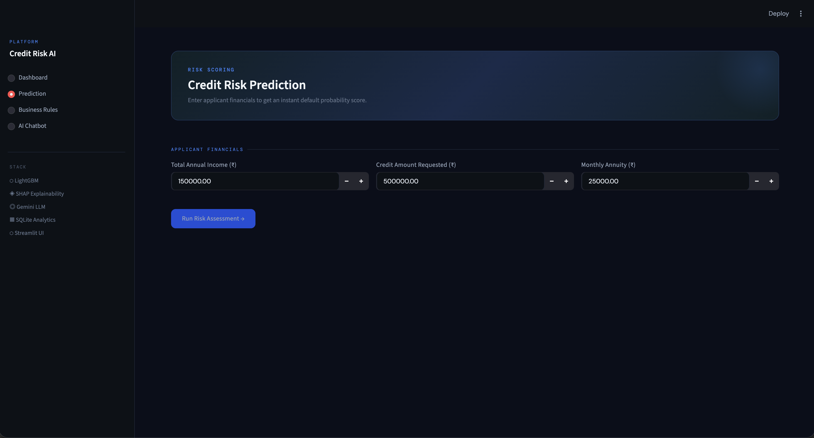
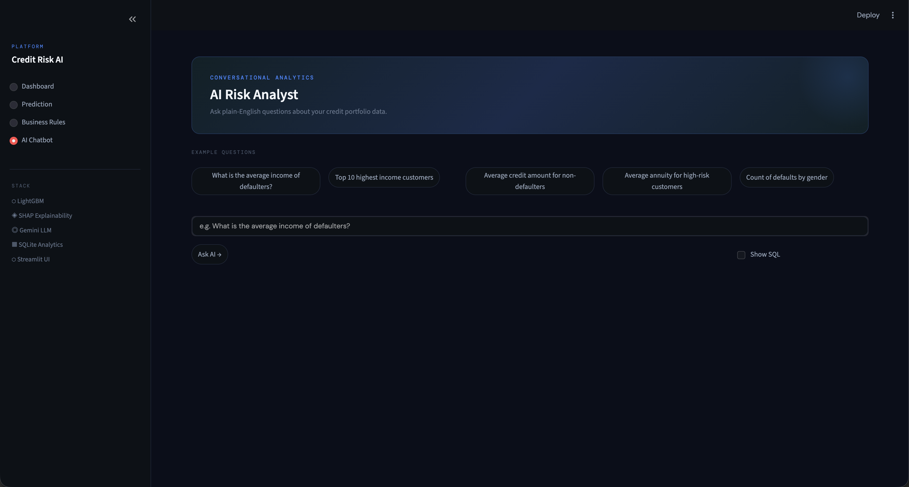

AI Credit Risk Intelligence Platform

A modern AI-powered fintech analytics platform that predicts customer credit default risk using Machine Learning and provides conversational business analytics using LLM-generated SQL queries.

-> Features:

        Credit Risk Prediction
            Predicts loan default probability
            Risk categorization:
                Low Risk
                Medium Risk
                High Risk

        Explainable AI
            SHAP Summary Plot
            SHAP Waterfall Plot
            Transparent prediction explanations

        Conversational Analytics
            Natural Language → SQL generation
            SQLite-powered analytics
            Business-readable responses

        Business Decision Rules
            Human-readable risk policies
            ML-driven business insights

        Modern Streamlit UI
            Interactive dashboard
            Prediction interface
            AI chatbot
            Business analytics pages

        Dockerized Deployment
            Dockerfile
            docker-compose support
            Environment variable configuration

-> System Architecture:

        User
          ↓
    Streamlit Frontend
          ↓
 ┌───────────────────────┐
 │                       │
 ↓                       ↓
ML Prediction        AI Chatbot
(LightGBM)           (LLM + SQL)
 ↓                       ↓
SHAP Explainability   SQLite Database
 │                       │
 └──────────↓────────────┘
     Business Insights

-> Machine Learning Pipeline
    Data Preprocessing
    Missing value handling
    Feature engineering
    Encoding categorical variables
    Scaling numerical features
    Outlier clipping

-> Model
    LightGBM Classifier

-> Class Imbalance Handling
    scale_pos_weight=12
    to handle highly imbalanced default classes.

-> Model Outputs
    Default probability
    Risk score
    Risk category

-> Explainable AI

    Implemented SHAP explainability:
        Global feature importance
        Local prediction explanations
        Waterfall plots
        Risk-driving feature analysis

-> Talk-to-Data System

    Users can ask questions like:

    What is the average income of defaulters?

    The system:
        Converts question → SQL
        Validates SQL safely
        Executes query on SQLite
        Returns readable business insights

-> Hallucination Control & SQL Safety

    Implemented multiple safeguards:

        SELECT-only query generation
        SQL validation layer
        Restricted table access
        Prompt grounding using schema
        LIMIT 100 row restriction

-> Business Rules

    Example rules derived from ML behavior:

        Low income + high credit exposure → High Risk
        High annuity burden increases repayment risk
        Stable income + moderate credit → Low Risk
        High credit-to-income ratio indicates elevated default probability

->Tech Stack

    Component	        Technology
    Frontend	        Streamlit
    ML Model	        LightGBM
    Explainability	    SHAP
    Database	        SQLite
    LLM Integration	    OpenRouter
    Deployment	        Docker
    Language	        Python

-> Project Structure

    Credit_Risk_Platform/

    ├── app.py
    ├── Dockerfile
    ├── docker-compose.yml
    ├── requirements.txt
    ├── .env.example
    │
    ├── assets/
    │   └── charts/
    │
    ├── data/
    │   ├── processed/
    │   └── database/
    │
    ├── models/
    │
    ├── notebooks/
    │
    ├── src/
    │   ├── data/
    │   ├── ml/
    │   ├── rules/
    │   ├── talk_to_data/
    │   └── utils/

-> Local Setup
    1. Clone Repository
        git clone https://github.com/AdhilMuhammed21/Credit_Risk_Platform.git

        cd Credit_Risk_Platform

    2. Create Environment
        python -m venv venv

        Activate:

                Mac/Linux
                    source venv/bin/activate
                Windows
                    venv\\Scripts\\activate

    3. Install Dependencies

    pip install -r requirements.txt

    4.Configure Environment Variables

    Create:

        .env

        Add:

        OPENROUTER_API_KEY=your_api_key
    5.Run Application
        streamlit run app.py

    6. Docker Setup
        Build & Run
        docker-compose up --build

    Open:

        http://localhost:8501   

-> Evaluation Metrics

    The platform includes:

        Confusion Matrix
        Feature Importance
        SHAP Explainability
        Risk Probability Scoring

-> Application Screenshots

        Add screenshots here:
        Dashboard
        
    
        Prediction Page
        

        AI Chatbot
        
    
        Business Rules
        

->Future Improvements
    Cloud deployment
    Real-time streaming analytics
    Role-based authentication
    Advanced fraud analytics
    Multi-language chatbot
    Live monitoring dashboards

->Author

    Adhil Muhammed
    B.Tech Computer Science Engineering